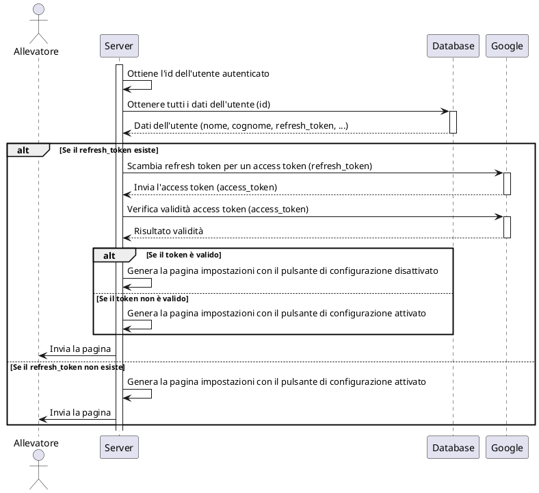

- **Controllo Token Google**

```plantuml
@startuml
actor Allevatore as User
participant "Server" as Server
participant "Database" as DB
participant "Google" as Google

activate Server
Server -> Server: Ottiene l'id dell'utente autenticato
Server -> DB: Ottenere tutti i dati dell'utente (id)
activate DB
DB --> Server: Dati dell'utente (nome, cognome, refresh_token, ...)
deactivate DB
alt Se il refresh_token esiste
    Server -> Google: Scambia refresh token per un access token (refresh_token)
    activate Google
    Google --> Server: Invia l'access token (access_token)
    deactivate Google
    Server -> Google: Verifica validità access token (access_token)
    activate Google
    Google --> Server: Risultato validità
    deactivate Google

    alt Se il token è valido
        Server -> Server: Genera la pagina impostazioni con il pulsante di configurazione disattivato
    else Se il token non è valido
        Server -> Server: Genera la pagina impostazioni con il pulsante di configurazione attivato
    end
        Server -> User: Invia la pagina

else Se il refresh_token non esiste
    Server -> Server: Genera la pagina impostazioni con il pulsante di configurazione attivato
    Server -> User: Invia la pagina
end

@enduml
```