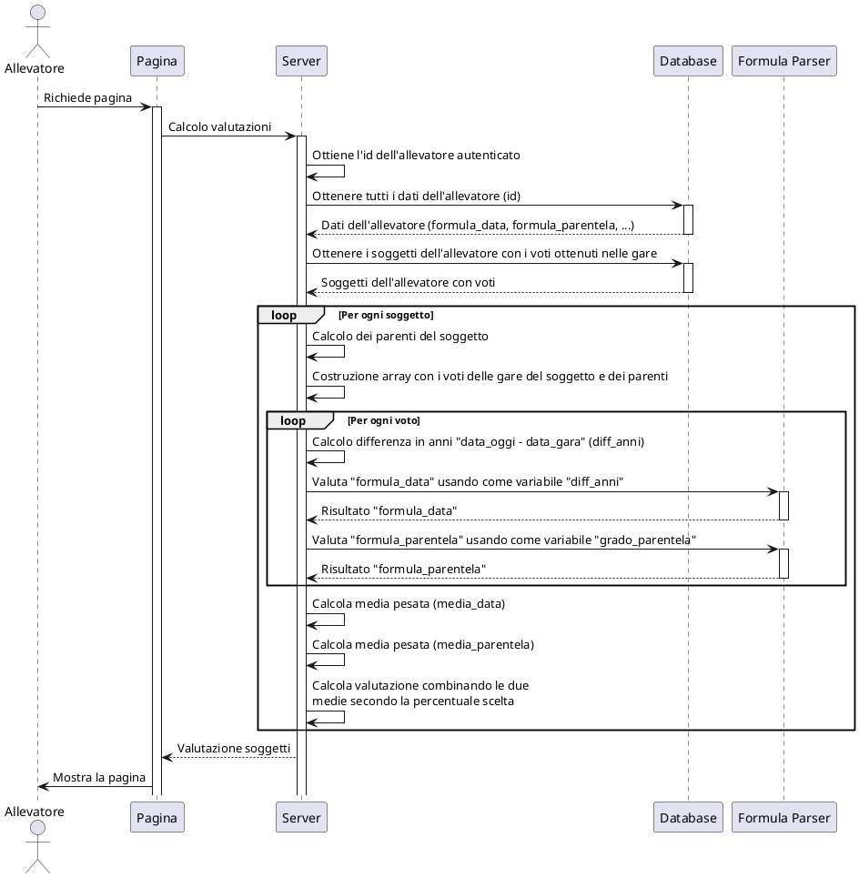
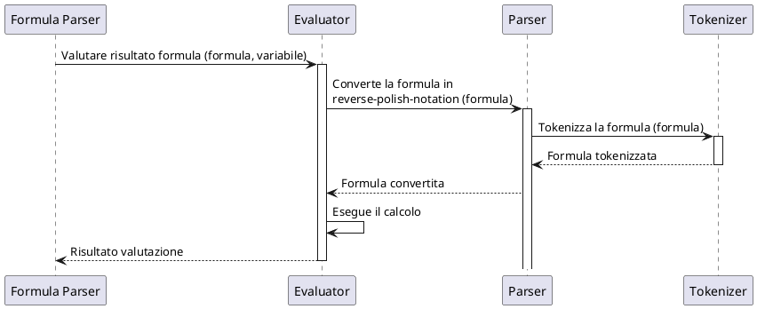
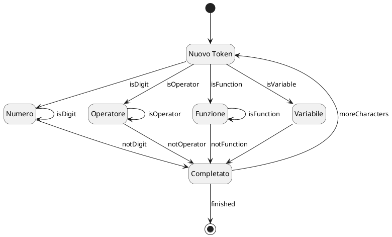

- **Calcolo valutazione dei soggetti**

```plantuml
@startuml
actor Allevatore
participant Pagina
participant Server
participant Database as DB
participant "Formula Parser" as FP

Allevatore -> Pagina: Richiede pagina
activate Pagina
Pagina -> Server: Calcolo valutazioni
activate Server
Server -> Server: Ottiene l'id dell'allevatore autenticato

Server -> DB: Ottenere tutti i dati dell'allevatore (id)
activate DB
DB --> Server: Dati dell'allevatore (formula_data, formula_parentela, ...)
deactivate DB

Server -> DB: Ottenere i soggetti dell'allevatore con i voti ottenuti nelle gare
activate DB
DB --> Server: Soggetti dell'allevatore con voti
deactivate DB

loop Per ogni soggetto
Server -> Server: Calcolo dei parenti del soggetto
Server -> Server: Costruzione array con i voti delle gare del soggetto e dei parenti
    loop Per ogni voto
        Server -> Server: Calcolo differenza in anni "data_oggi - data_gara" (diff_anni)
        Server -> FP: Valuta "formula_data" usando come variabile "diff_anni"
        activate FP
        FP --> Server: Risultato "formula_data"
        deactivate FP
        Server -> FP: Valuta "formula_parentela" usando come variabile "grado_parentela"
        activate FP
        FP --> Server: Risultato "formula_parentela"
        deactivate FP
    end loop
    Server -> Server: Calcola media pesata (media_data)
    Server -> Server: Calcola media pesata (media_parentela)
    Server -> Server: Calcola valutazione combinando le due\nmedie secondo la percentuale scelta
end loop

Server --> Pagina: Valutazione soggetti
Pagina -> Allevatore: Mostra la pagina

@enduml
```

- **Valutazione formula**

```plantuml
@startuml
participant "Formula Parser" as FP
participant Evaluator
participant Parser
participant Tokenizer as TK

FP -> Evaluator: Valutare risultato formula (formula, variabile)
activate Evaluator

Evaluator -> Parser: Converte la formula in\nreverse-polish-notation (formula)
activate Parser

Parser -> TK: Tokenizza la formula (formula)
activate TK
TK --> Parser: Formula tokenizzata
deactivate TK

Parser --> Evaluator: Formula convertita

Evaluator -> Evaluator: Esegue il calcolo

Evaluator --> FP: Risultato valutazione
deactivate Evaluator

@enduml
```

- **Tokenizzazione formula**

```plantuml
@startuml
hide empty description 

state "Nuovo Token" as Nuovo
[*] --> Nuovo

Nuovo --> Numero: isDigit
Nuovo --> Operatore: isOperator
Nuovo --> Funzione: isFunction
Nuovo --> Variabile: isVariable

Numero --> Numero: isDigit
Operatore --> Operatore: isOperator
Funzione --> Funzione: isFunction

Numero --> Completato: notDigit
Operatore --> Completato: notOperator
Funzione --> Completato: notFunction
Variabile --> Completato

Completato --> Nuovo: moreCharacters
Completato --> [*]: finished

@enduml
```