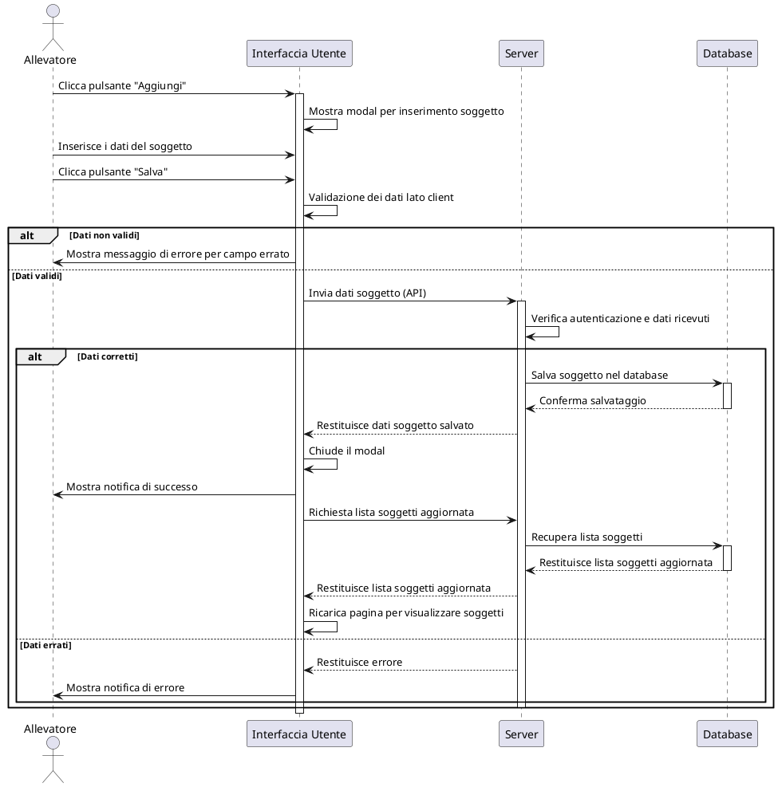

- **Aggiunta di un soggetto**

```plantuml
@startuml
actor Allevatore as User
participant "Interfaccia Utente" as UI
participant "Server" as Server
participant "Database" as DB

User -> UI: Clicca pulsante "Aggiungi"
activate UI
UI -> UI: Mostra modal per inserimento soggetto
User -> UI: Inserisce i dati del soggetto
User -> UI: Clicca pulsante "Salva"
UI -> UI: Validazione dei dati lato client
alt Dati non validi
    UI -> User: Mostra messaggio di errore per campo errato
else Dati validi
    UI -> Server: Invia dati soggetto (API)
    activate Server
    Server -> Server: Verifica autenticazione e dati ricevuti
    alt Dati corretti
        Server -> DB: Salva soggetto nel database
        activate DB
        DB --> Server: Conferma salvataggio
        deactivate DB
        Server --> UI: Restituisce dati soggetto salvato
        UI -> UI: Chiude il modal
        UI -> User: Mostra notifica di successo
        UI -> Server: Richiesta lista soggetti aggiornata
        Server -> DB: Recupera lista soggetti
        activate DB
        DB --> Server: Restituisce lista soggetti aggiornata
        deactivate DB
        Server --> UI: Restituisce lista soggetti aggiornata
        UI -> UI: Ricarica pagina per visualizzare soggetti
    else Dati errati
        Server --> UI: Restituisce errore
        UI -> User: Mostra notifica di errore
    end
    deactivate Server
end
deactivate UI
@enduml
```
