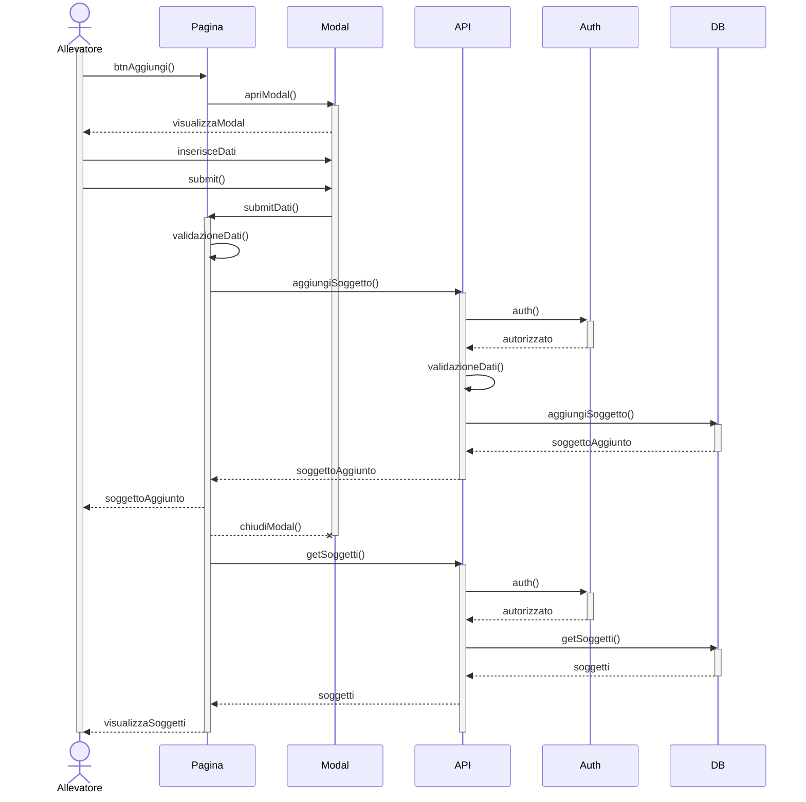

- **Aggiunta di un soggetto**

```mermaid
sequenceDiagram
actor Allevatore
activate Allevatore
Allevatore ->> Pagina: btnAggiungi()
Pagina ->> Modal: apriModal()
activate Modal
Modal -->> Allevatore: visualizzaModal
Allevatore ->> Modal: inserisceDati
Allevatore ->> Modal: submit()
Modal ->> Pagina: submitDati()
activate Pagina
Pagina ->> Pagina: validazioneDati()
Pagina ->> API: aggiungiSoggetto()
activate API
API ->>+ Auth: auth()
Auth -->>- API: autorizzato
API ->> API: validazioneDati()
API ->> DB: aggiungiSoggetto()
activate DB
DB -->> API: soggettoAggiunto
deactivate DB
API -->> Pagina: soggettoAggiunto
deactivate API
Pagina -->> Allevatore: soggettoAggiunto
Pagina --X Modal: chiudiModal()
deactivate Modal
Pagina ->> API: getSoggetti()
activate API
API ->>+ Auth: auth()
Auth -->>- API: autorizzato
API ->> DB: getSoggetti()
activate DB
DB -->> API: soggetti
deactivate DB
API -->> Pagina: soggetti
Pagina -->> Allevatore: visualizzaSoggetti
deactivate API
deactivate Pagina
deactivate Allevatore
```
