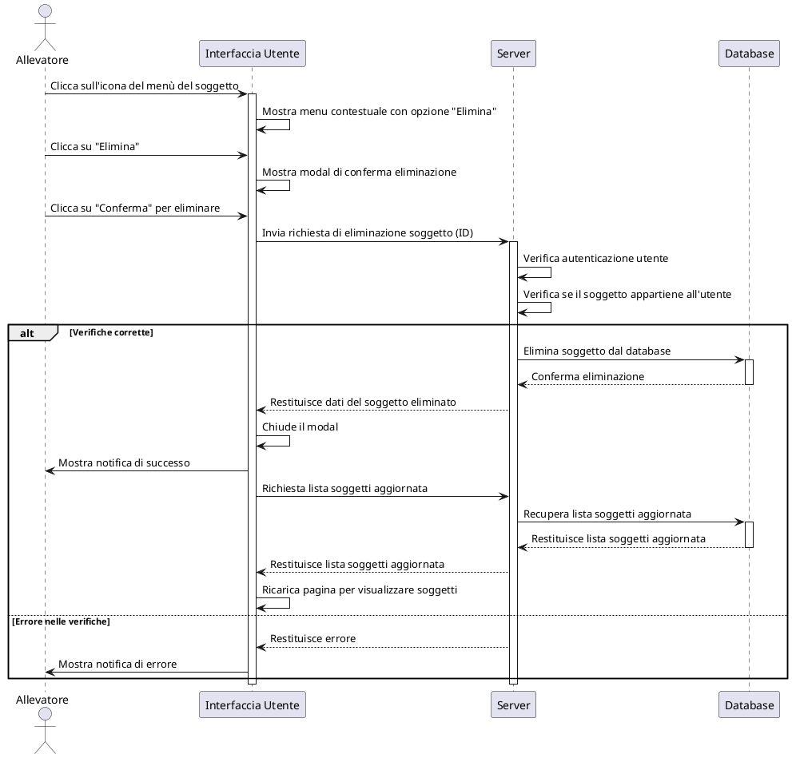

- **Eliminazione soggetto**

```plantuml
@startuml
actor Allevatore as User
participant "Interfaccia Utente" as UI
participant "Server" as Server
participant "Database" as DB

User -> UI: Clicca sull'icona del menù del soggetto
activate UI
UI -> UI: Mostra menu contestuale con opzione "Elimina"
User -> UI: Clicca su "Elimina"
UI -> UI: Mostra modal di conferma eliminazione
User -> UI: Clicca su "Conferma" per eliminare
UI -> Server: Invia richiesta di eliminazione soggetto (ID)
activate Server
Server -> Server: Verifica autenticazione utente
Server -> Server: Verifica se il soggetto appartiene all'utente
alt Verifiche corrette
    Server -> DB: Elimina soggetto dal database
    activate DB
    DB --> Server: Conferma eliminazione
    deactivate DB
    Server --> UI: Restituisce dati del soggetto eliminato
    UI -> UI: Chiude il modal
    UI -> User: Mostra notifica di successo
    UI -> Server: Richiesta lista soggetti aggiornata
    Server -> DB: Recupera lista soggetti aggiornata
    activate DB
    DB --> Server: Restituisce lista soggetti aggiornata
    deactivate DB
    Server --> UI: Restituisce lista soggetti aggiornata
    UI -> UI: Ricarica pagina per visualizzare soggetti
else Errore nelle verifiche
    Server --> UI: Restituisce errore
    UI -> User: Mostra notifica di errore
end
deactivate Server
deactivate UI
@enduml
```
