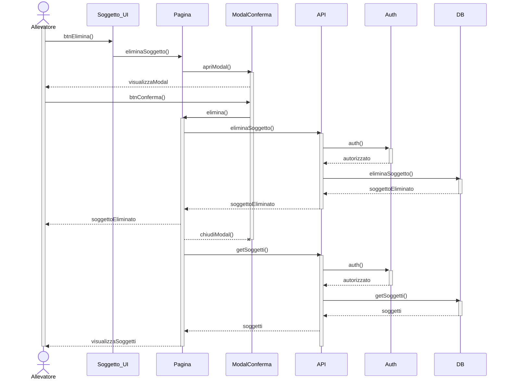

- **Eliminazione soggetto**

```mermaid
sequenceDiagram
actor Allevatore
activate Allevatore
Allevatore ->> Soggetto_UI: btnElimina()
Soggetto_UI ->> Pagina: eliminaSoggetto()
Pagina ->> ModalConferma: apriModal()
activate ModalConferma
ModalConferma -->> Allevatore: visualizzaModal
Allevatore ->> ModalConferma: btnConferma()
ModalConferma ->> Pagina: elimina()
activate Pagina
Pagina ->> API: eliminaSoggetto()
activate API
API ->>+ Auth: auth()
Auth -->>- API: autorizzato
API ->> DB: eliminaSoggetto()
activate DB
DB -->> API: soggettoEliminato
deactivate DB
API -->> Pagina: soggettoEliminato
deactivate API
Pagina -->> Allevatore: soggettoEliminato
Pagina --X ModalConferma: chiudiModal()
deactivate ModalConferma
Pagina ->> API: getSoggetti()
activate API
API ->>+ Auth: auth()
Auth -->>- API: autorizzato
API ->> DB: getSoggetti()
activate DB
DB -->> API: soggetti
deactivate DB
API -->> Pagina: soggetti
Pagina -->> Allevatore: visualizzaSoggetti
deactivate API
deactivate Pagina
deactivate Allevatore
```
