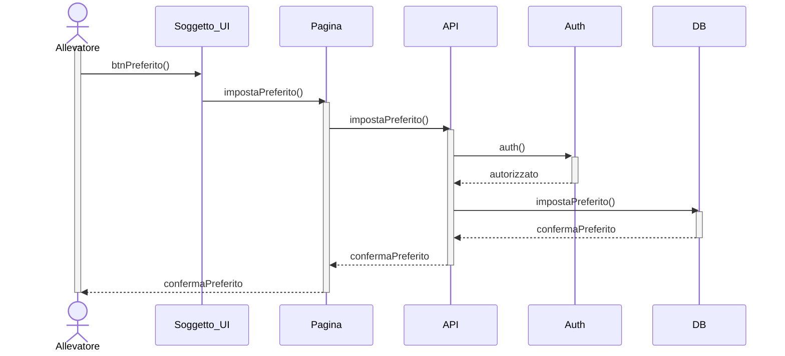

- **Contrassegnare Preferito**

```mermaid
sequenceDiagram
actor Allevatore
activate Allevatore
Allevatore ->> Soggetto_UI: btnPreferito()
Soggetto_UI ->> Pagina: impostaPreferito()
activate Pagina
Pagina ->> API: impostaPreferito()
activate API
API ->>+ Auth: auth()
Auth -->>- API: autorizzato
API ->> DB: impostaPreferito()
activate DB
DB -->> API: confermaPreferito
deactivate DB
API -->> Pagina: confermaPreferito
deactivate API
Pagina -->> Allevatore: confermaPreferito
deactivate Pagina
deactivate Allevatore
```
