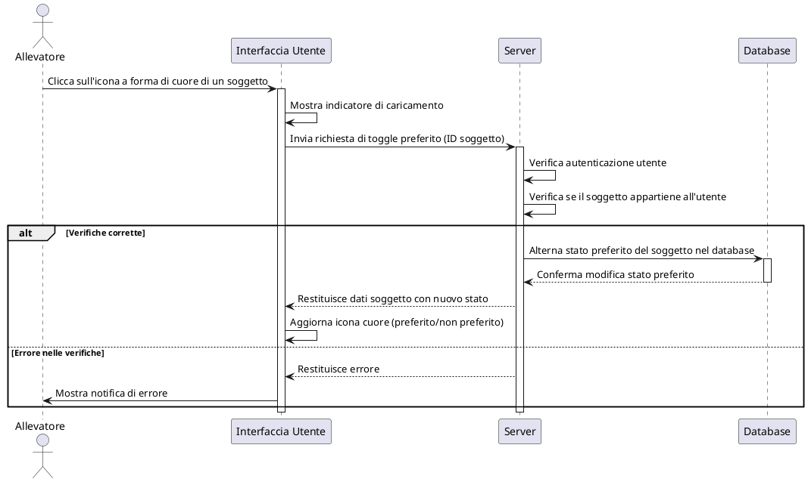

- **Contrassegnare Preferito**

```plantuml
@startuml
actor Allevatore as User
participant "Interfaccia Utente" as UI
participant "Server" as Server
participant "Database" as DB

User -> UI: Clicca sull'icona a forma di cuore di un soggetto
activate UI
UI -> UI: Mostra indicatore di caricamento
UI -> Server: Invia richiesta di toggle preferito (ID soggetto)
activate Server
Server -> Server: Verifica autenticazione utente
Server -> Server: Verifica se il soggetto appartiene all'utente
alt Verifiche corrette
    Server -> DB: Alterna stato preferito del soggetto nel database
    activate DB
    DB --> Server: Conferma modifica stato preferito
    deactivate DB
    Server --> UI: Restituisce dati soggetto con nuovo stato
    UI -> UI: Aggiorna icona cuore (preferito/non preferito)
else Errore nelle verifiche
    Server --> UI: Restituisce errore
    UI -> User: Mostra notifica di errore
end
deactivate Server
deactivate UI
@enduml
```
