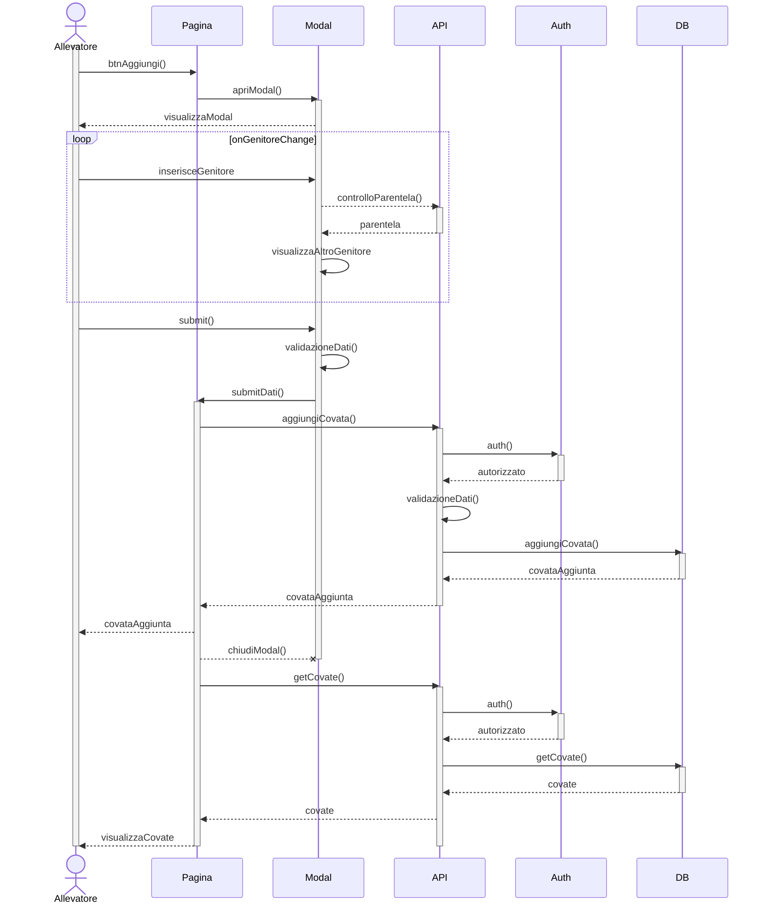

- **Aggiunta di una covata**

```mermaid
sequenceDiagram
actor Allevatore
activate Allevatore
Allevatore ->> Pagina: btnAggiungi()
Pagina ->> Modal: apriModal()
activate Modal
Modal -->> Allevatore: visualizzaModal
loop onGenitoreChange
  Allevatore ->> Modal: inserisceGenitore
  Modal -->> API: controlloParentela()
  activate API
  API -->> Modal: parentela
  deactivate API
  Modal ->> Modal: visualizzaAltroGenitore
end
Allevatore ->> Modal: submit()
Modal ->> Modal: validazioneDati()
Modal ->> Pagina: submitDati()
activate Pagina
Pagina ->> API: aggiungiCovata()
activate API
API ->>+ Auth: auth()
Auth -->>- API: autorizzato
API ->> API: validazioneDati()
API ->> DB: aggiungiCovata()
activate DB
DB -->> API: covataAggiunta
deactivate DB
API -->> Pagina: covataAggiunta
deactivate API
Pagina -->> Allevatore: covataAggiunta
Pagina --X Modal: chiudiModal()
deactivate Modal
Pagina ->> API: getCovate()
activate API
API ->>+ Auth: auth()
Auth -->>- API: autorizzato
API ->> DB: getCovate()
activate DB
DB -->> API: covate
deactivate DB
API -->> Pagina: covate
Pagina -->> Allevatore: visualizzaCovate
deactivate API
deactivate Pagina
deactivate Allevatore
```
