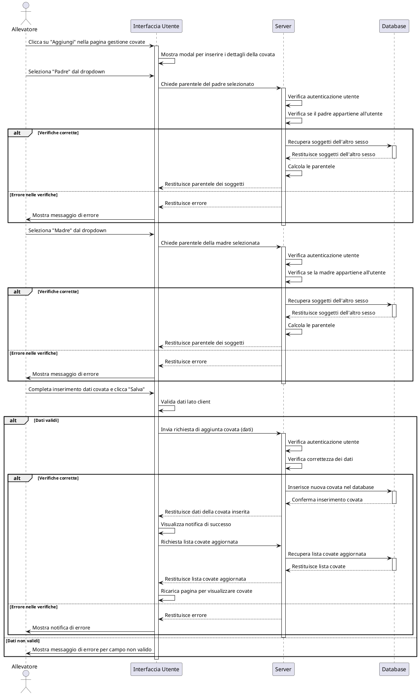

- **Aggiunta di una covata**

```plantuml
@startuml
actor Allevatore as User
participant "Interfaccia Utente" as UI
participant "Server" as Server
participant "Database" as DB

User -> UI: Clicca su "Aggiungi" nella pagina gestione covate
activate UI
UI -> UI: Mostra modal per inserire i dettagli della covata
User -> UI: Seleziona "Padre" dal dropdown
UI -> Server: Chiede parentele del padre selezionato
activate Server
Server -> Server: Verifica autenticazione utente
Server -> Server: Verifica se il padre appartiene all'utente
alt Verifiche corrette
    Server -> DB: Recupera soggetti dell'altro sesso
    activate DB
    DB --> Server: Restituisce soggetti dell'altro sesso
    deactivate DB
    Server -> Server : Calcola le parentele
    Server --> UI: Restituisce parentele dei soggetti
else Errore nelle verifiche
    Server --> UI: Restituisce errore
    UI -> User: Mostra messaggio di errore
end
deactivate Server

User -> UI: Seleziona "Madre" dal dropdown
UI -> Server: Chiede parentele della madre selezionata
activate Server
Server -> Server: Verifica autenticazione utente
Server -> Server: Verifica se la madre appartiene all'utente
alt Verifiche corrette
    Server -> DB: Recupera soggetti dell'altro sesso
    activate DB
    DB --> Server: Restituisce soggetti dell'altro sesso
    deactivate DB
    Server -> Server : Calcola le parentele
    Server --> UI: Restituisce parentele dei soggetti
else Errore nelle verifiche
    Server --> UI: Restituisce errore
    UI -> User: Mostra messaggio di errore
end
deactivate Server

User -> UI: Completa inserimento dati covata e clicca "Salva"
UI -> UI: Valida dati lato client
alt Dati validi
    UI -> Server: Invia richiesta di aggiunta covata (dati)
    activate Server
    Server -> Server: Verifica autenticazione utente
    Server -> Server: Verifica correttezza dei dati
    alt Verifiche corrette
        Server -> DB: Inserisce nuova covata nel database
        activate DB
        DB --> Server: Conferma inserimento covata
        deactivate DB
        Server --> UI: Restituisce dati della covata inserita
        UI -> UI: Visualizza notifica di successo
        UI -> Server: Richiesta lista covate aggiornata
        Server -> DB: Recupera lista covate aggiornata
        activate DB
        DB --> Server: Restituisce lista covate
        deactivate DB
        Server --> UI: Restituisce lista covate aggiornata
        UI -> UI: Ricarica pagina per visualizzare covate
    else Errore nelle verifiche
        Server --> UI: Restituisce errore
        UI -> User: Mostra notifica di errore
    end
    deactivate Server
else Dati non validi
    UI -> User: Mostra messaggio di errore per campo non valido
end
deactivate UI
@enduml

```
