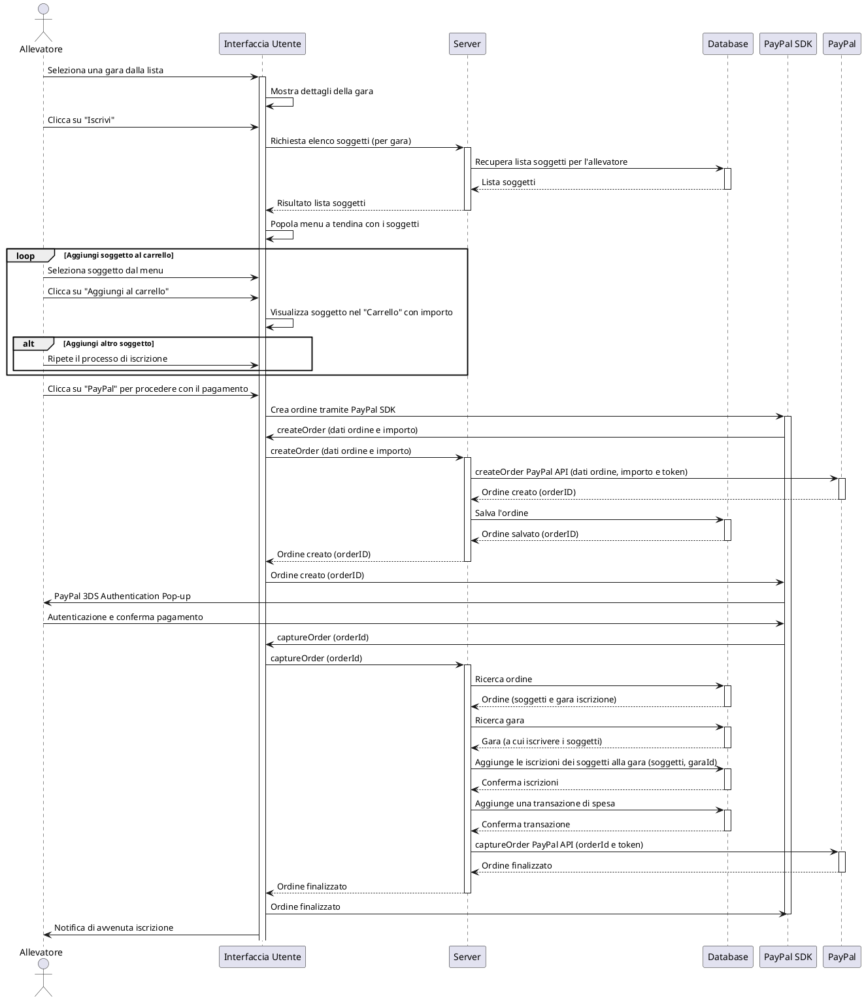

- **Iscrizione soggetto**

```plantuml
@startuml
actor Allevatore as User
participant "Interfaccia Utente" as UI
participant "Server" as APIServer
participant "Database" as DB
participant "PayPal SDK" as PayPalSDK
participant "PayPal" as PayPalAPI

User -> UI: Seleziona una gara dalla lista
activate UI
UI -> UI: Mostra dettagli della gara
User -> UI: Clicca su "Iscrivi"
UI -> APIServer: Richiesta elenco soggetti (per gara)
activate APIServer
APIServer -> DB: Recupera lista soggetti per l'allevatore
activate DB
DB --> APIServer: Lista soggetti
deactivate DB
APIServer --> UI: Risultato lista soggetti
deactivate APIServer
UI -> UI: Popola menu a tendina con i soggetti

loop Aggiungi soggetto al carrello
    User -> UI: Seleziona soggetto dal menu
    User -> UI: Clicca su "Aggiungi al carrello"
    UI -> UI: Visualizza soggetto nel "Carrello" con importo

    alt Aggiungi altro soggetto
        User -> UI: Ripete il processo di iscrizione
    end
end

User -> UI: Clicca su "PayPal" per procedere con il pagamento
UI -> PayPalSDK: Crea ordine tramite PayPal SDK
activate PayPalSDK
PayPalSDK -> UI: createOrder (dati ordine e importo)
UI -> APIServer: createOrder (dati ordine e importo)
activate APIServer
APIServer -> PayPalAPI: createOrder PayPal API (dati ordine, importo e token)
activate PayPalAPI
PayPalAPI --> APIServer: Ordine creato (orderID)
deactivate PayPalAPI
APIServer -> DB: Salva l'ordine
activate DB
DB --> APIServer: Ordine salvato (orderID)
deactivate DB
APIServer --> UI: Ordine creato (orderID)
deactivate APIServer
UI -> PayPalSDK: Ordine creato (orderID)
PayPalSDK -> User: PayPal 3DS Authentication Pop-up
User -> PayPalSDK: Autenticazione e conferma pagamento

PayPalSDK -> UI: captureOrder (orderId)
UI -> APIServer: captureOrder (orderId)
activate APIServer
APIServer -> DB: Ricerca ordine
activate DB
DB --> APIServer: Ordine (soggetti e gara iscrizione)
deactivate DB

APIServer -> DB: Ricerca gara
activate DB
DB --> APIServer: Gara (a cui iscrivere i soggetti)
deactivate DB

APIServer -> DB: Aggiunge le iscrizioni dei soggetti alla gara (soggetti, garaId)
activate DB
DB --> APIServer: Conferma iscrizioni
deactivate DB

APIServer -> DB: Aggiunge una transazione di spesa
activate DB
DB --> APIServer: Conferma transazione
deactivate DB

APIServer -> PayPalAPI: captureOrder PayPal API (orderId e token)
activate PayPalAPI
PayPalAPI --> APIServer: Ordine finalizzato
deactivate PayPalAPI
APIServer --> UI: Ordine finalizzato
deactivate APIServer

UI -> PayPalSDK: Ordine finalizzato
deactivate PayPalSDK
UI -> User: Notifica di avvenuta iscrizione
@enduml
```