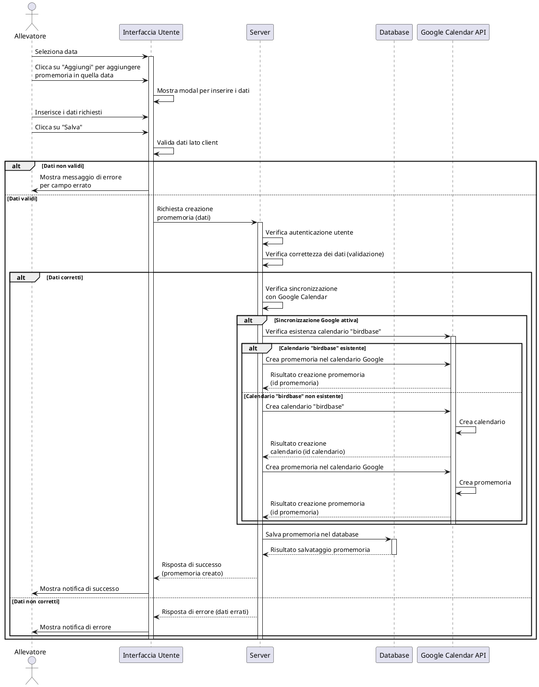

- **Aggiunta Promemoria**

```plantuml
@startuml
actor Allevatore as User
participant "Interfaccia Utente" as UI
participant "Server" as APIServer
participant "Database" as DB
participant "Google Calendar API" as GoogleCalendar

User -> UI: Seleziona data
activate UI
User -> UI: Clicca su "Aggiungi" per aggiungere\npromemoria in quella data
UI -> UI: Mostra modal per inserire i dati
User -> UI: Inserisce i dati richiesti
User -> UI: Clicca su "Salva"
UI -> UI: Valida dati lato client

alt Dati non validi
    UI -> User: Mostra messaggio di errore\nper campo errato
else Dati validi
    UI -> APIServer: Richiesta creazione\npromemoria (dati)
    activate APIServer
    APIServer -> APIServer: Verifica autenticazione utente
    APIServer -> APIServer: Verifica correttezza dei dati (validazione)
    alt Dati corretti
        APIServer -> APIServer: Verifica sincronizzazione\ncon Google Calendar
        alt Sincronizzazione Google attiva
            APIServer -> GoogleCalendar: Verifica esistenza calendario "birdbase"
            activate GoogleCalendar
            alt Calendario "birdbase" esistente
                APIServer -> GoogleCalendar: Crea promemoria nel calendario Google
                GoogleCalendar --> APIServer: Risultato creazione promemoria\n(id promemoria)
            else Calendario "birdbase" non esistente
                APIServer -> GoogleCalendar: Crea calendario "birdbase"
                GoogleCalendar -> GoogleCalendar: Crea calendario
                GoogleCalendar --> APIServer: Risultato creazione\ncalendario (id calendario)
                APIServer -> GoogleCalendar: Crea promemoria nel calendario Google
                GoogleCalendar -> GoogleCalendar: Crea promemoria
                GoogleCalendar --> APIServer: Risultato creazione promemoria\n(id promemoria)
            end
            deactivate GoogleCalendar
        end
        APIServer -> DB: Salva promemoria nel database
        activate DB
        DB --> APIServer: Risultato salvataggio promemoria
        deactivate DB
        APIServer --> UI: Risposta di successo\n(promemoria creato)
        UI -> User: Mostra notifica di successo
    else Dati non corretti
        APIServer --> UI: Risposta di errore (dati errati)
        UI -> User: Mostra notifica di errore
    end
    deactivate APIServer
    deactivate UI
end
@enduml
```