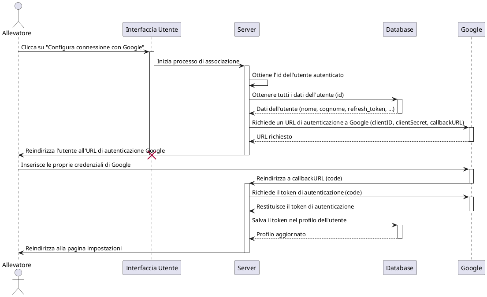

- **Configurazione Google Calendar**

```plantuml
@startuml
actor Allevatore as User
participant "Interfaccia Utente" as UI
participant "Server" as Server
participant "Database" as DB
participant "Google" as Google

User -> UI: Clicca su "Configura connessione con Google"
activate UI
UI -> Server: Inizia processo di associazione
activate Server
Server -> Server: Ottiene l'id dell'utente autenticato
Server -> DB: Ottenere tutti i dati dell'utente (id)
activate DB
DB --> Server: Dati dell'utente (nome, cognome, refresh_token, ...)
deactivate DB
Server -> Google: Richiede un URL di autenticazione a Google (clientID, clientSecret, callbackURL)
activate Google
Google --> Server: URL richiesto
deactivate Google
Server -> User: Reindirizza l'utente all'URL di autenticazione Google
deactivate Server
destroy UI
User -> Google: Inserisce le proprie credenziali di Google
activate Google
Google -> Server: Reindirizza a callbackURL (code)
deactivate Google
activate Server
Server -> Google: Richiede il token di autenticazione (code)
activate Google
Google --> Server: Restituisce il token di autenticazione
deactivate Google
Server -> DB: Salva il token nel profilo dell'utente
activate DB
DB --> Server: Profilo aggiornato
deactivate DB
Server -> User: Reindirizza alla pagina impostazioni
deactivate Server
@enduml
```