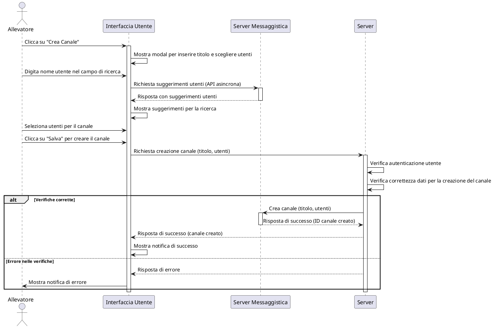

- **Chat di gruppo**

```plantuml
@startuml
actor Allevatore as User
participant "Interfaccia Utente" as UI
participant "Server Messaggistica" as MsgServer
participant "Server" as Backend

User -> UI: Clicca su "Crea Canale"
activate UI
UI -> UI: Mostra modal per inserire titolo e scegliere utenti
User -> UI: Digita nome utente nel campo di ricerca
UI -> MsgServer: Richiesta suggerimenti utenti (API asincrona)
activate MsgServer

MsgServer --> UI: Risposta con suggerimenti utenti
deactivate MsgServer
UI -> UI: Mostra suggerimenti per la ricerca
User -> UI: Seleziona utenti per il canale
User -> UI: Clicca su "Salva" per creare il canale
UI -> Backend: Richiesta creazione canale (titolo, utenti)
activate Backend
Backend -> Backend: Verifica autenticazione utente
Backend -> Backend: Verifica correttezza dati per la creazione del canale
alt Verifiche corrette
    Backend -> MsgServer: Crea canale (titolo, utenti)
    activate MsgServer
    MsgServer --> Backend: Risposta di successo (ID canale creato)
    deactivate MsgServer
    Backend --> UI: Risposta di successo (canale creato)
    UI -> UI: Mostra notifica di successo
else Errore nelle verifiche
    Backend --> UI: Risposta di errore
    UI -> User: Mostra notifica di errore
end
deactivate Backend
deactivate UI
@enduml
```