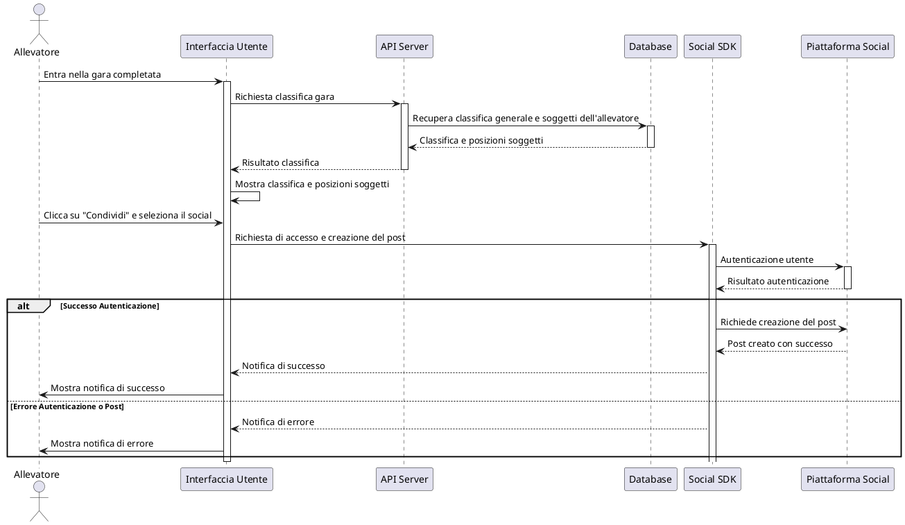

- **Condivisione Risultati Social**

```plantuml
@startuml
actor Allevatore as User
participant "Interfaccia Utente" as UI
participant "API Server" as APIServer
participant "Database" as DB
participant "Social SDK" as SocialAPI
participant "Piattaforma Social" as SocialPlatform

User -> UI: Entra nella gara completata
activate UI
UI -> APIServer: Richiesta classifica gara
activate APIServer
APIServer -> DB: Recupera classifica generale e soggetti dell'allevatore
activate DB
DB --> APIServer: Classifica e posizioni soggetti
deactivate DB
APIServer --> UI: Risultato classifica
deactivate APIServer
UI -> UI: Mostra classifica e posizioni soggetti

User -> UI: Clicca su "Condividi" e seleziona il social
UI -> SocialAPI: Richiesta di accesso e creazione del post
activate SocialAPI
SocialAPI -> SocialPlatform: Autenticazione utente
activate SocialPlatform
SocialPlatform --> SocialAPI: Risultato autenticazione
deactivate SocialPlatform

alt Successo Autenticazione
    SocialAPI -> SocialPlatform: Richiede creazione del post
    SocialPlatform --> SocialAPI: Post creato con successo
    SocialAPI --> UI: Notifica di successo
    UI -> User: Mostra notifica di successo
else Errore Autenticazione o Post
    SocialAPI --> UI: Notifica di errore
    UI -> User: Mostra notifica di errore
end

deactivate UI

@enduml
```