## - Login

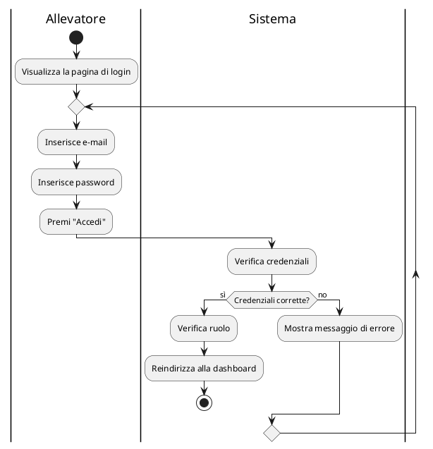

## - Aggiungere, modificare o eliminare transazioni

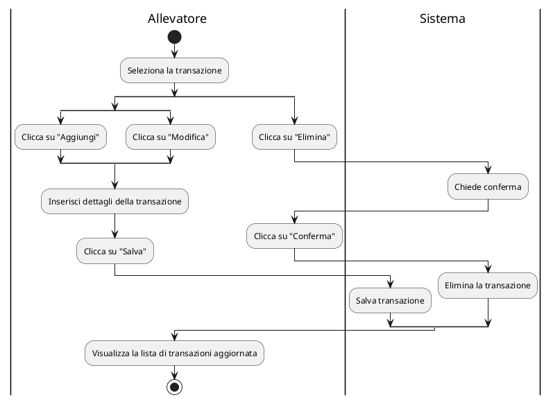

## - Generare report di un arco temporale

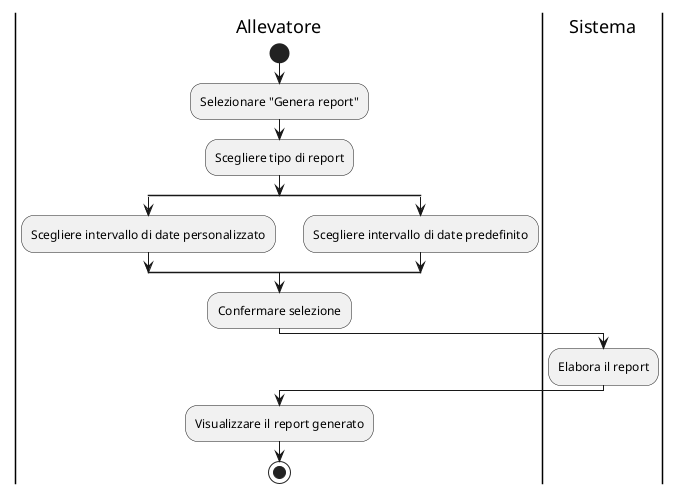

## - Aggiungere un soggetto

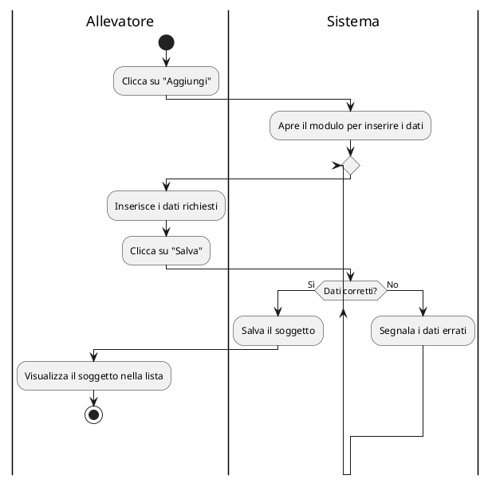

## - Modificare un soggetto

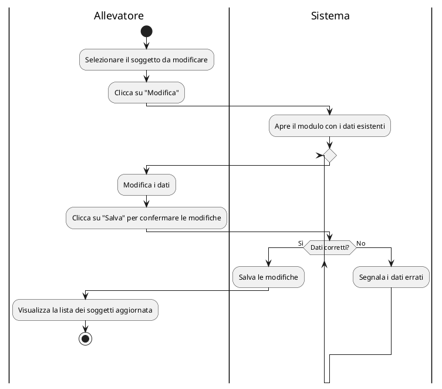

## - Selezionare un soggetto come preferito

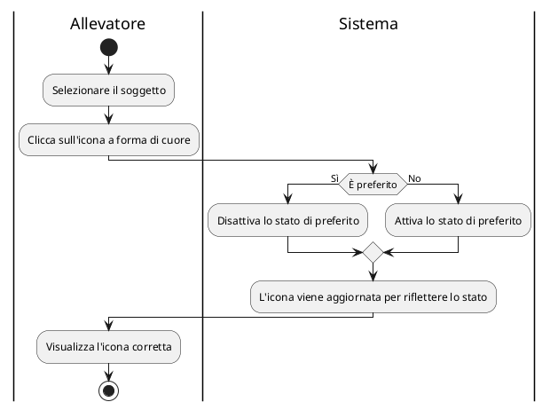

## - Aggiungere una covata

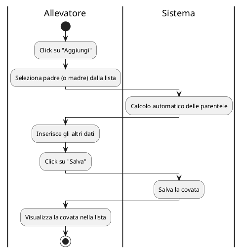

## - Aggiungere figli a una covata

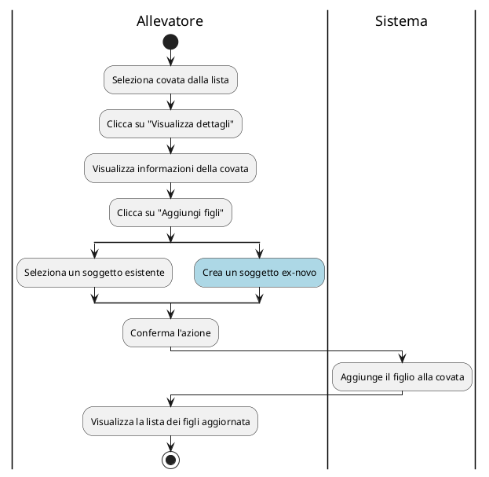

## - Creare un promemoria

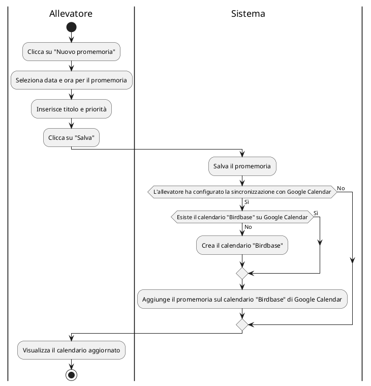
## - Configurare connessione con Google Calendar

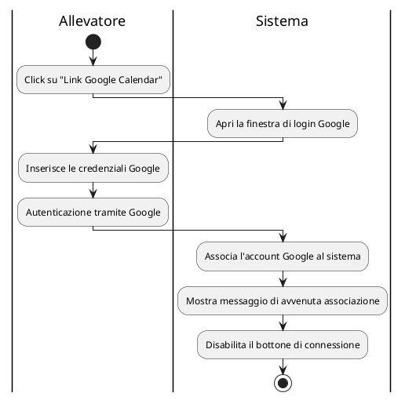

## - Visualizzare i dettagli di una gara

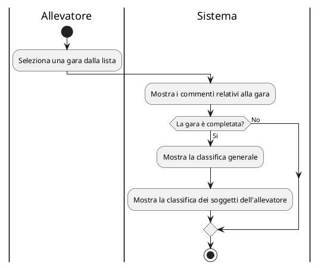

## - Visualizzare la classifica di una gara completata

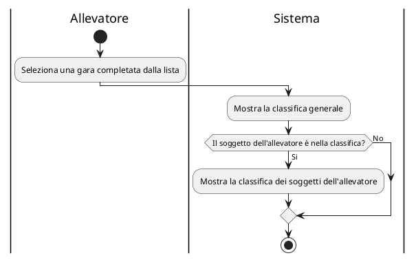

## - Condividere sui social i soggetti classificati

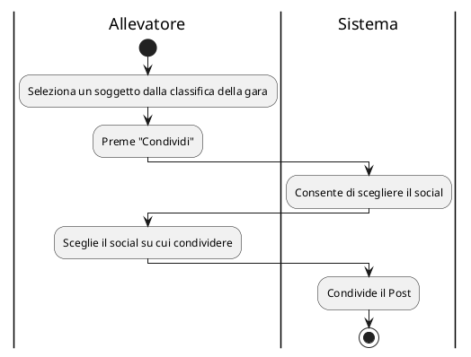

## - Selezionare i soggetti da iscrivere ed effettuare il pagamento con Paypal

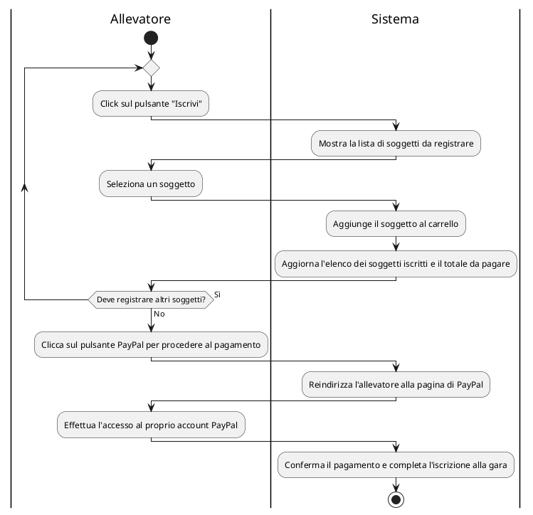


## - Creare un annuncio di vendita

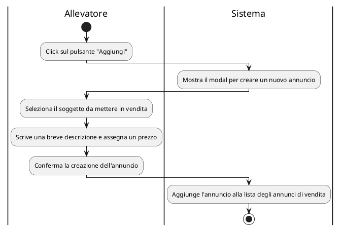

## - Modificare un annuncio di vendita

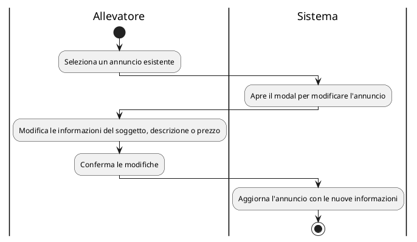

## - Visualizzare un annuncio e acquistare un soggetto

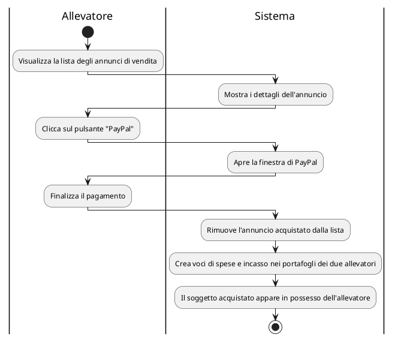

## - Chattare con un altro allevatore
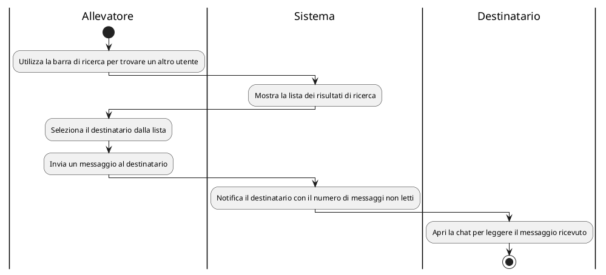

## - Creare un Canale di chat di gruppo
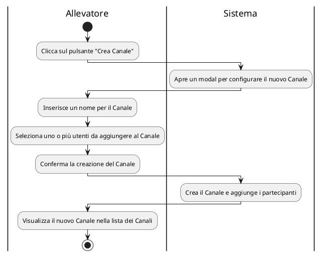

## - Richiedere la registrazione
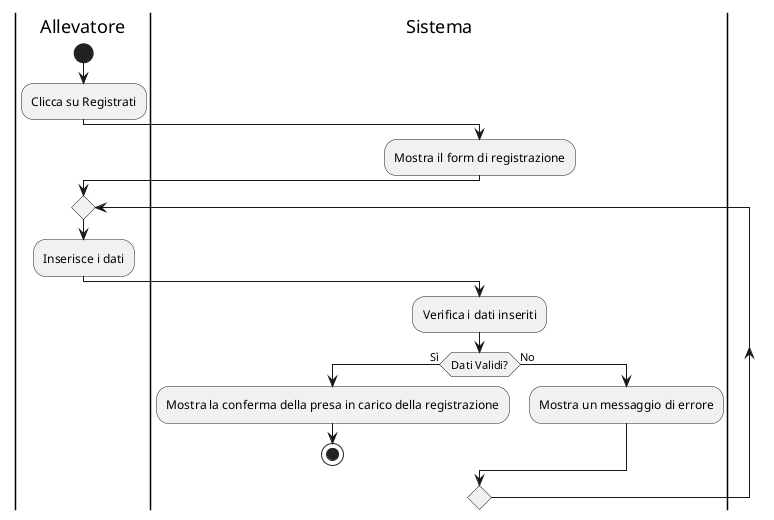

## - Effettuare il login dopo la registrazione
```plantuml
@startuml
|Allevatore|
start
:Clicca sulla pagina di login;
repeat
|Allevatore|
:Inserire email e password;

|Sistema|
:Verifica i dati di login;

|Sistema|
:Verifica che i dati siano corretti;

|Sistema|
if(Dati Corretti?) then (Sì)
    :Effettua il login con successo;
    stop
else (No)
    :Mostra un messaggio di errore;
endif
repeatwhile()  
@enduml


```

## - L'amministratore approva o riufiuta richieste di registrazione
```plantuml
@startuml
|Amministratore|
start
:Accede alla pagina "Registrazioni";
:Visualizza lista delle richieste di registrazione;
:Seleziona una richiesta;

|Sistema|
:Mostra richiesta selezionata;

|Amministratore|
:Esamina i dettagli della richiesta;
:Seleziona "Approva" o "Rifiuta";

|Sistema|
if (Approvata?) then (Sì)
  :Aggiorna stato della richiesta a "Approvata";
  :Invia notifica via e-mail con la password di accesso;
else (No)
  :Aggiorna stato della richiesta a "Rifiutata";
  :Invia notifica via e-mail con il motivo del rifiuto;
endif

|Sistema|
stop
@enduml

```

## - Aggiungere una nuova gara
```plantuml
@startuml

|Amministratore|
start
:Click su "Aggiungi";

|Sistema|
:Mostra modulo di creazione gara;

|Amministratore|
:Inserisce informazioni gara;
:Conferma creazione gara;

|Sistema|
:Salva la gara con lo stato selezionato;
stop
@enduml

```

## - Cambiare lo stato di una gara
```plantuml
@startuml

|Amministratore|
start
:Seleziona una gara;

|Amministratore|
:Modifica lo stato;
:Salva modifica stato;

|Sistema|
:Aggiorna stato della gara;
stop
@enduml

```

## - Stabilire la classifica di una gara
```plantuml
@startuml

|Amministratore|
start
:Seleziona una gara con stato "Da valutare";

|Sistema|
:Rende visibili i campi per i punteggi;

|Amministratore|
:Inserisce i punteggi dei partecipanti;
:Clicca su "Salva" per memorizzare i punteggi;
:Modifica stato gara in "Completata";

|Sistema|
:Salva punteggi e aggiorna stato della gara;
stop
@enduml

```

## - Scegliere le formule per il calcolo della valutazione dei soggetti
```plantuml
@startuml

|Allevatore|
start
:Inserisce le formule;

|Sistema|
:Verifica la correttezza delle formule;
if (Valida?) then (Sì)
  :Mostra graficamente le formule;
else (No)
  :Mostra il messaggio di errore;
endif

|Allevatore|
:Clicca su "Salva";

|Sistema|
:Salva le formule inserite;
stop
@enduml

```