## - Login

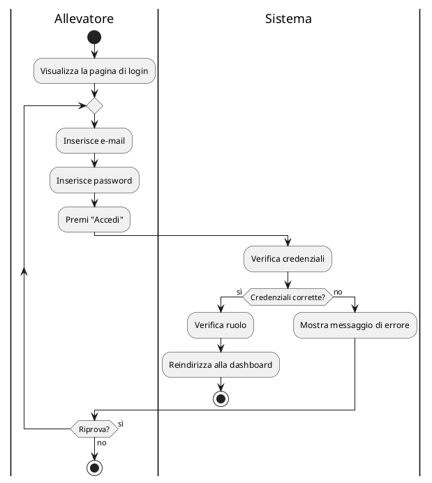

## - Aggiungere, modificare o eliminare transazioni

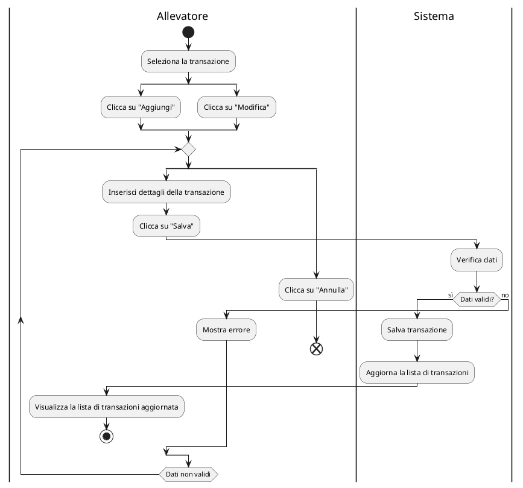

## - Eliminare transazioni

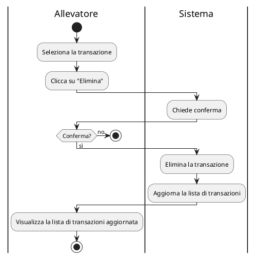

## - Generare report di un arco temporale

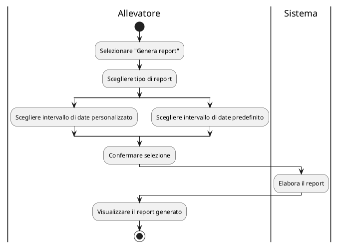

## - Aggiungere un soggetto

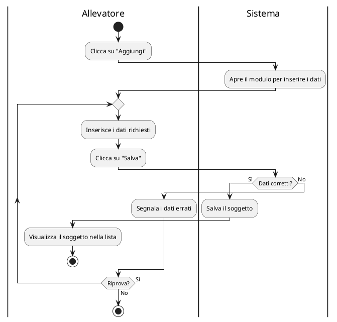

## - Modificare un soggetto

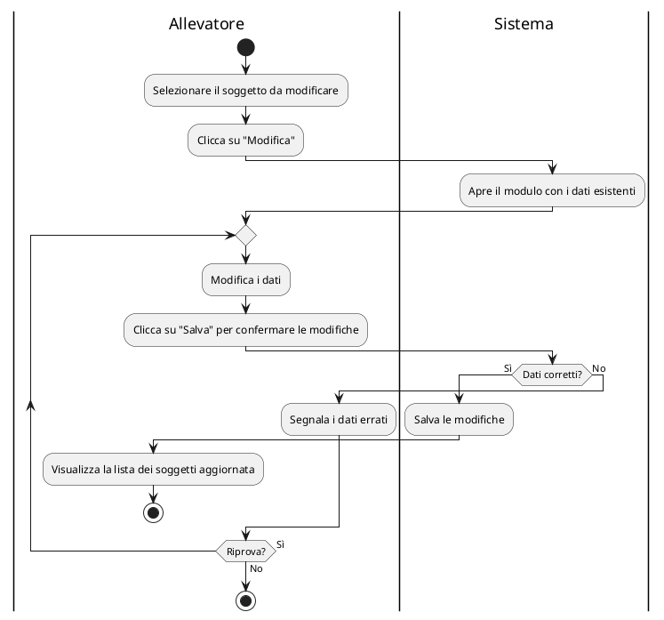

## - Selezionare un soggetto come preferito

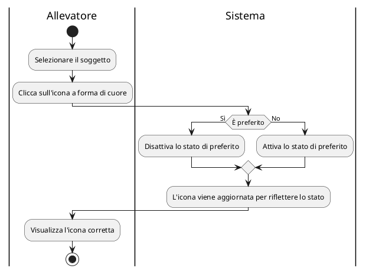

## - Aggiungere una covata

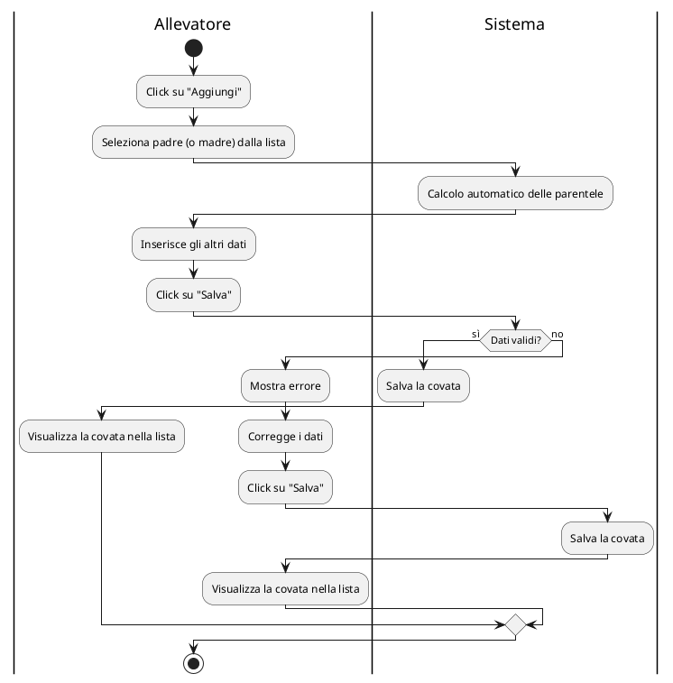

## - Aggiungere figli a una covata

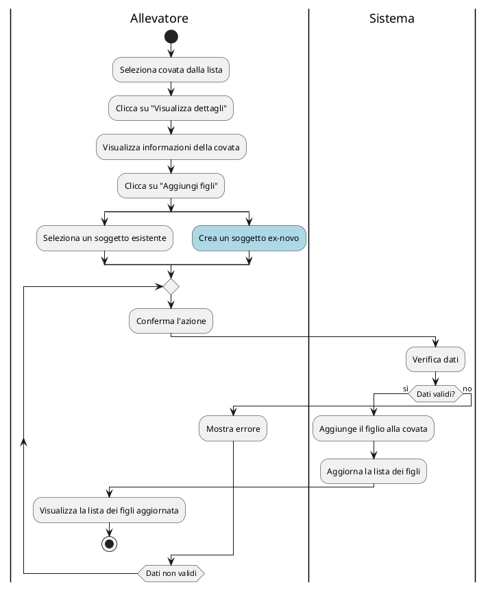

## - Creare un promemoria

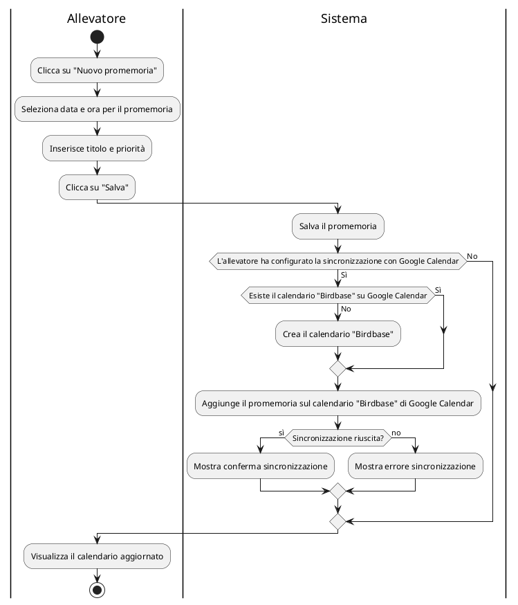

## - Configurare connessione con Google Calendar

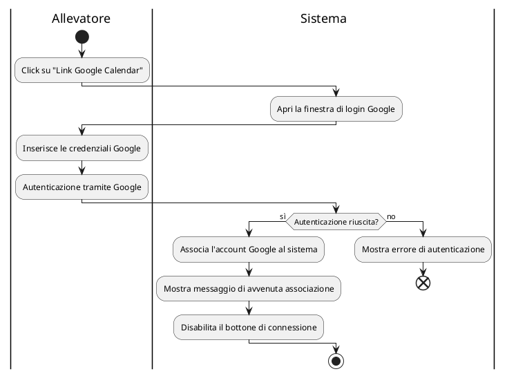

## - Visualizzare i dettagli di una gara

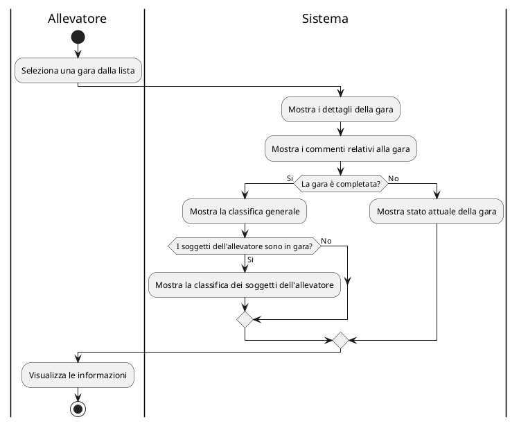

## - Visualizzare la classifica di una gara completata

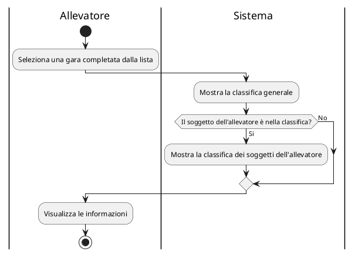

## - Condividere sui social i soggetti classificati

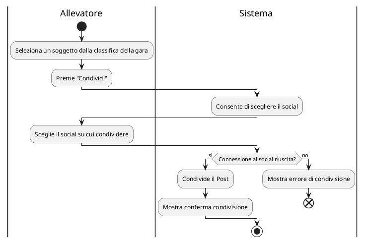

## - Selezionare i soggetti da iscrivere ed effettuare il pagamento con Paypal

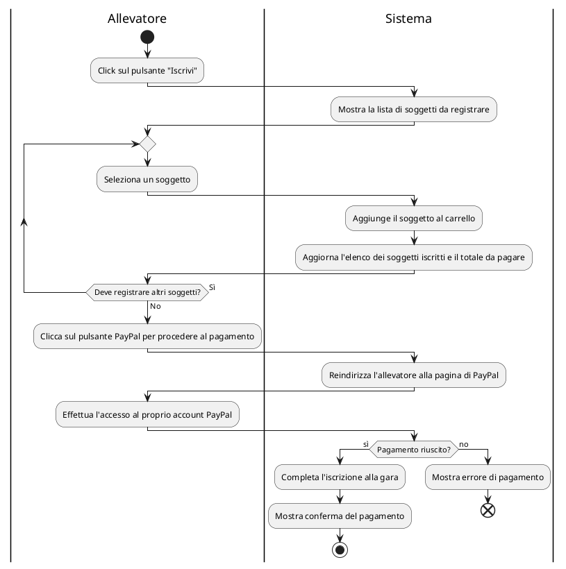

## - Creare un annuncio di vendita

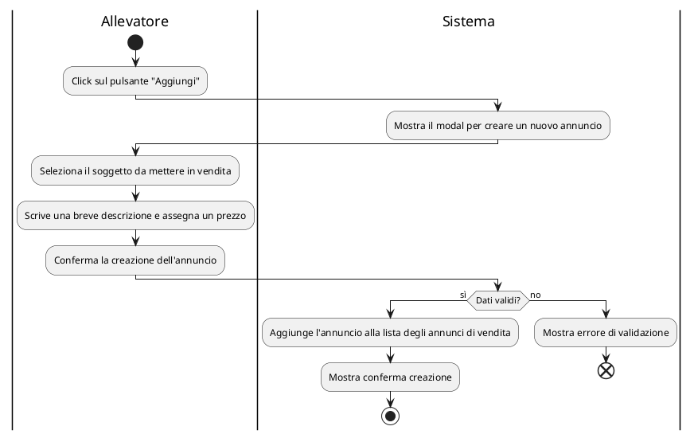

## - Modificare un annuncio di vendita

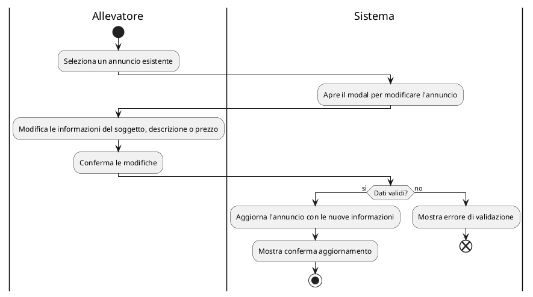

## - Visualizzare un annuncio e acquistare un soggetto

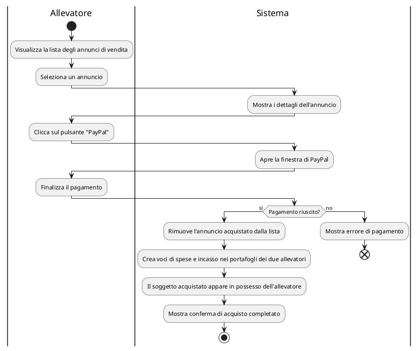

## - Chattare con un altro allevatore

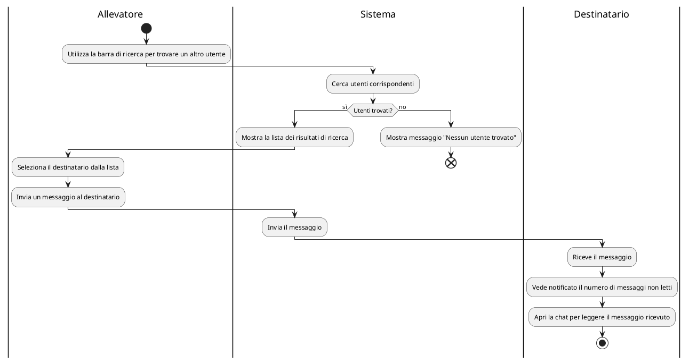

## - Creare un Canale di chat di gruppo

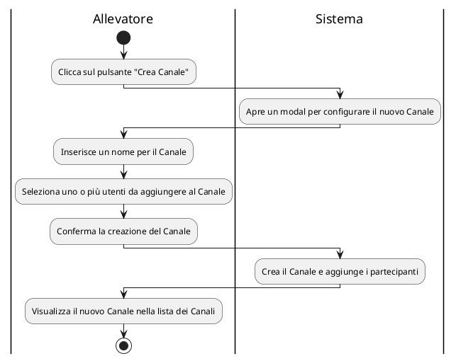

## - Richiedere la registrazione

```plantuml
@startuml
|Allevatore|
start
:Clicca su Registrati;
|Sistema|
:Mostra il form di registrazione;
|Allevatore|
repeat
    :Inserisce i dati;
    :Invia il form;
    |Sistema|
    :Verifica i dati inseriti;
    if (Dati Validi?) then (Sì)
        :Salva la richiesta di registrazione;
        :Mostra la conferma della presa in carico della registrazione;
        stop
    else (No)
        :Mostra errori di validazione;
        |Allevatore|
    endif
repeat while (Riprova?) is (Sì) not (No)
end
@enduml

```

## - Effettuare il login dopo la registrazione

```plantuml
@startuml
|Allevatore|
start
:Clicca sulla pagina di login;
repeat
    :Inserire email e password;
    :Invia form di login;
    |Sistema|
    :Verifica i dati di login;
    if (Dati Corretti?) then (Sì)
        :Effettua il login con successo;
        :Reindirizza alla dashboard;
        stop
    else (No)
        :Mostra un messaggio di errore;
        |Allevatore|
    endif
repeat while (Riprova?) is (Sì) not (No)
end
@enduml


```

## - L'amministratore approva o riufiuta richieste di registrazione

```plantuml
@startuml
|Amministratore|
start
:Accede alla pagina "Registrazioni";
|Amministratore|
:Visualizza lista delle richieste di registrazione;
:Seleziona una richiesta;
|Sistema|
:Mostra richiesta selezionata;
|Amministratore|
:Esamina i dettagli della richiesta;
if (Decisione?) then (Rifiuta)
    |Amministratore|
    :Seleziona "Rifiuta";
    :Inserisce motivo del rifiuto;
    |Sistema|
    :Aggiorna stato della richiesta a "Rifiutata";
    :Invia notifica via e-mail con il motivo del rifiuto;
else (Approva)
    :Seleziona "Approva";
    |Sistema|
    :Aggiorna stato della richiesta a "Approvata";
    :Invia notifica via e-mail con la password di accesso;
endif
|Amministratore|
stop
@enduml

```

## - Aggiungere una nuova gara

```plantuml
@startuml
|Amministratore|
start
:Click su "Aggiungi";
|Sistema|
:Mostra modulo di creazione gara;
|Amministratore|
repeat
    :Inserisce informazioni gara;
    :Conferma creazione gara;
    |Sistema|
    :Verifica dati;
    if (Dati validi?) then (sì)
        :Salva la gara con lo stato selezionato;
        :Mostra conferma creazione;
        stop
    else (no)
        :Mostra errori di validazione;
        |Amministratore|
    endif
repeat while (Dati non validi)
@enduml

```

## - Cambiare lo stato di una gara

```plantuml
@startuml
|Amministratore|
start
:Seleziona una gara;
|Sistema|
:Mostra i dettagli della gara;
|Amministratore|
repeat
    :Modifica lo stato;
    :Salva modifica stato;
    |Sistema|
    if (Modifica valida?) then (no)
        :Mostra errore di validazione;
    else (sì)
        :Aggiorna stato della gara;
        :Mostra conferma aggiornamento;
        stop
    endif
repeat while (Dati non validi)

@enduml

```

## - Stabilire la classifica di una gara

```plantuml
@startuml
|Amministratore|
start
:Seleziona una gara con stato "Da valutare";
|Sistema|
:Verifica lo stato della gara;
if (Stato corretto?) then (sì)
    :Rende visibili i campi per i punteggi;
    |Amministratore|
    repeat
        :Inserisce i punteggi dei partecipanti;
        :Clicca su "Salva" per memorizzare i punteggi;
        |Sistema|
        if (Punteggi validi?) then (sì)
            :Salva punteggi;
            :Modifica stato gara in "Completata";
            :Genera la classifica definitiva;
        else (no)
            :Mostra errori nei punteggi;
        endif
    repeat while (Punteggi validi) is (no) not (si)
else (no)
    :Mostra errore stato non valido;
    end
endif
stop
@enduml
```

## - Scegliere le formule per il calcolo della valutazione dei soggetti

```plantuml
@startuml
|Allevatore|
start
:Accede alla sezione impostazioni;
repeat
:Inserisce la formula;
|Sistema|
:Verifica la correttezza della formula;
if (Formula valida?) then (Sì)
    :Mostra graficamente la formula;
    |Allevatore|
    :Clicca su "Salva";
    |Sistema|
    :Salva le formule inserite;
    :Mostra conferma salvataggio;
    stop
else (No)
    :Mostra il messaggio di errore;
endif
repeat while (Formula valida?) is (No) not (Sì)
@enduml

```
